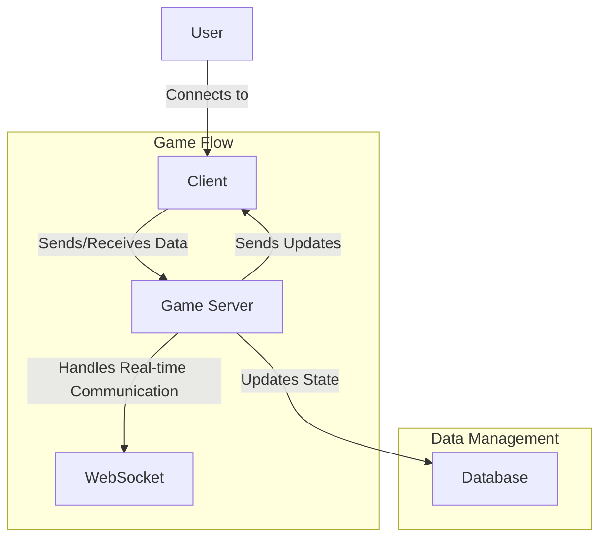

This time, we'll make a basic multiplayer "Collect the Coins" game where players move around and collect coins that appear on the canvas. The player with the most collected coins wins.



1. Project Setup
Initialize the Project:

```bash
mkdir multiplayer-collect-coins
cd multiplayer-collect-coins
npm init -y
npm install express socket.io
```

Create Directory Structure:
```bash
mkdir public
```

2. Server-Side Code (server.js)
Create a file named server.js in the root directory of your project. This will set up the Node.js server using Express and Socket.IO.

```javascript
const express = require('express');
const http = require('http');
const socketIo = require('socket.io');

const app = express();
const server = http.createServer(app);
const io = socketIo(server);

const PORT = 3000;

app.use(express.static('public'));

const players = {};
const coins = [];
const numCoins = 10;

function generateRandomPosition() {
    return {
        x: Math.floor(Math.random() * 780) + 10,
        y: Math.floor(Math.random() * 580) + 10
    };
}

// Initialize coins
for (let i = 0; i < numCoins; i++) {
    coins.push({...generateRandomPosition(), collected: false});
}

io.on('connection', (socket) => {
    console.log('New player connected:', socket.id);

    players[socket.id] = {
        x: Math.random() * 780 + 10,
        y: Math.random() * 580 + 10,
        width: 20,
        height: 20,
        score: 0,
        color: `#${Math.floor(Math.random() * 16777215).toString(16)}`
    };

    socket.emit('init', { id: socket.id, players, coins });
    socket.broadcast.emit('newPlayer', { id: socket.id, player: players[socket.id] });

    socket.on('playerMove', (data) => {
        if (players[socket.id]) {
            players[socket.id].x = data.x;
            players[socket.id].y = data.y;
            checkCoinCollection(socket.id);
            io.emit('gameState', { players, coins });
        }
    });

    socket.on('disconnect', () => {
        console.log('Player disconnected:', socket.id);
        delete players[socket.id];
        io.emit('playerDisconnect', { id: socket.id });
    });
});

function checkCoinCollection(playerId) {
    const player = players[playerId];
    coins.forEach(coin => {
        if (!coin.collected && 
            player.x < coin.x + 10 &&
            player.x + player.width > coin.x &&
            player.y < coin.y + 10 &&
            player.y + player.height > coin.y) {
            coin.collected = true;
            players[playerId].score++;
        }
    });
}

setInterval(() => {
    io.emit('gameState', { players, coins });
}, 1000 / 60); // 60 FPS

server.listen(PORT, () => {
    console.log(`Server running on http://localhost:${PORT}`);
});
```

3. Client-Side Code
Create an index.html file and a game.js file in the public directory.

public/index.html:

```html
<!DOCTYPE html>
<html lang="en">
<head>
    <meta charset="UTF-8">
    <meta name="viewport" content="width=device-width, initial-scale=1.0">
    <title>Multiplayer Collect Coins</title>
    <style>
        body { margin: 0; }
        canvas { background: #eee; display: block; margin: 0 auto; }
    </style>
</head>
<body>
    <canvas id="gameCanvas" width="800" height="600"></canvas>
    <script src="/socket.io/socket.io.js"></script>
    <script src="game.js"></script>
</body>
</html>
```

public/game.js:

```javascript
const canvas = document.getElementById('gameCanvas');
const ctx = canvas.getContext('2d');

const socket = io();

let playerId;
let player = {
    x: canvas.width / 2,
    y: canvas.height / 2,
    width: 20,
    height: 20
};
let players = {};
let coins = [];

socket.on('init', (data) => {
    playerId = data.id;
    players = data.players;
    coins = data.coins;
});

socket.on('newPlayer', (data) => {
    players[data.id] = data.player;
});

socket.on('gameState', (data) => {
    players = data.players;
    coins = data.coins;
    draw();
});

socket.on('playerDisconnect', (data) => {
    delete players[data.id];
});

function drawPlayer(p, color) {
    ctx.fillStyle = color;
    ctx.fillRect(p.x, p.y, p.width, p.height);
}

function drawCoin(coin) {
    if (!coin.collected) {
        ctx.beginPath();
        ctx.arc(coin.x, coin.y, 10, 0, Math.PI * 2);
        ctx.fillStyle = 'gold';
        ctx.fill();
        ctx.closePath();
    }
}

function draw() {
    ctx.clearRect(0, 0, canvas.width, canvas.height);
    for (let id in players) {
        drawPlayer(players[id], players[id].color);
    }
    coins.forEach(drawCoin);
}

function updatePlayerPosition() {
    socket.emit('playerMove', { x: player.x, y: player.y });
}

function handleKeydown(event) {
    switch(event.key) {
        case 'ArrowUp':
            player.y -= 5;
            break;
        case 'ArrowDown':
            player.y += 5;
            break;
        case 'ArrowLeft':
            player.x -= 5;
            break;
        case 'ArrowRight':
            player.x += 5;
            break;
    }
    updatePlayerPosition();
}

document.addEventListener('keydown', handleKeydown);

function gameLoop() {
    draw();
    requestAnimationFrame(gameLoop);
}

gameLoop();
```

4. Running the Server
    1. Start the Server:
```bash
node server.js
```

    2. Open Multiple Browser Tabs:

Open http://localhost:3000 in multiple tabs or different browsers to test the multiplayer functionality.

Explanation:
Server (server.js):
- Manages player connections, movements, and coin collection.
- Updates and broadcasts the game state to all clients.

Client (game.js):
Handles player input and communicates with the server.
Updates the canvas based on the game state received from the server.

This setup provides a basic multiplayer game where players move around to collect coins. You can enhance it by adding features like a timer, score display, or additional game mechanics.
